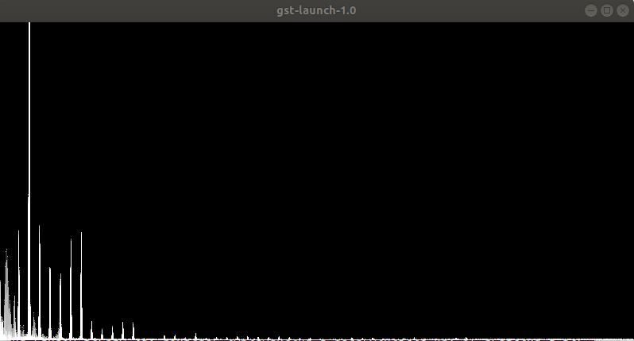
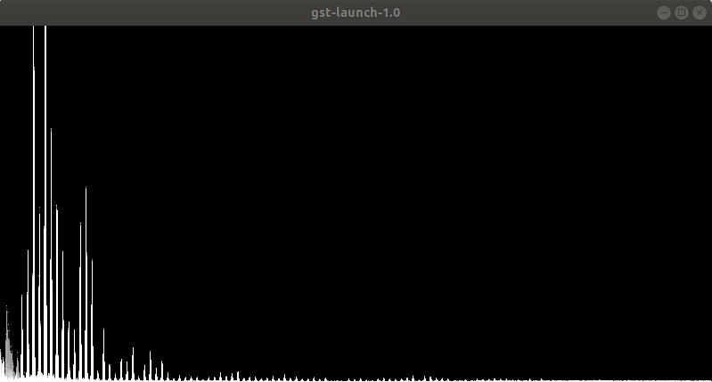

# Multiple Stream Mixing Test

## Questions

1. Is mixing incoming streams or just playing them through separate threads better?
2. How many streams can each technique handle {audiomixer vs separate threads} before breaking down?

## Testing

### Getting the Frequency Spectrum
`gst-launch-1.0 autoaudiosrc ! audio/x-raw,rate=16000,format=S16LE,channels=1 ! audioconvert ! spectrascope ! videoconvert ! video/x-raw,width=800,height=400 ! autovideosink`

### Test Setup (4 Stream Example)
#### Separate Threads
In **four** separate terminals:

*Terminal 1*

`gst-launch-1.0 audiotestsrc freq=262 ! audio/x-raw,rate=16000,format=S16LE,channels=1 ! audioconvert ! autoaudiosink`

*Terminal 2*

`gst-launch-1.0 audiotestsrc freq=327 ! audio/x-raw,rate=16000,format=S16LE,channels=1 ! audioconvert ! autoaudiosink`

*Terminal 3*

`gst-launch-1.0 audiotestsrc freq=393 ! audio/x-raw,rate=16000,format=S16LE,channels=1 ! audioconvert ! autoaudiosink`

*Terminal 4*

`gst-launch-1.0 audiotestsrc freq=524 ! audio/x-raw,rate=16000,format=S16LE,channels=1 ! audioconvert ! autoaudiosink`

#### Audiomixer Setup
In **one** terminal:

`gst-launch-1.0 audiotestsrc freq=262 ! audio/x-raw,rate=16000,format=S16LE,channels=1 ! audiomixer name=mix ! audioconvert ! autoaudiosink audiotestsrc freq=327 ! audio/x-raw,rate=16000,format=S16LE,channels=1 ! mix. audiotestsrc freq=393 ! audio/x-raw,rate=16000,format=S16LE,channels=1 ! mix. audiotestsrc freq=524 ! audio/x-raw,rate=16000,format=S16LE,channels=1 ! mix.`

## Results
### 2 Streams (C and E --> 262 Hz and 327.5 Hz respectively)
*Multiple Threads*

*Audio Mixer*

### 3 Streams (C, E, and G --> 262, 327.5, and 393 Hz respectively)
*Multiple Threads*

*Audio Mixer*

### 4 Streams (C, E, G, and High C --> 262, 327.5, 393 and 524 Hz respectively)
*Multiple Threads*

*Audio Mixer*

## Conclusions
1. It's hard to tell which is better --> both seem to handle 4 streams pretty easily. 
  * Audibly, they are almost identical. With 4 streams, audio mixing seemed to have a little more high frequency information, but that is a purely qualitative observation from an ear that is often out of tune
  * Visually, the FFTs are nearly identical for 2 and 3 streams. There are slight differences between the 4 stream FFTs, but no mutliplexing noise seemed to be introduced by threaded version
2. Audio system is either internally mixing output from separate threads or operating fast enough where mulitplexing between streams does not impact audio quality, as mixing and threading seems to display the same performance.
  * Risk: If extra operations are being performed by the device used for testing, performance of each technique may be significantly different on different/less complex devices
  * Impact: multiple threads is an easier architecture, but may suffer in performance depending on device --> more testing needed to determine this

## UPDATES!!!
* PulseAudio is a software server that can handle multiple incoming and outgoing streams --> This is why running the threads independently worked as well as mixing them. 'autoaudiosrc' most likely ran through pulseaudio
  * _Follow Up_: **Need to determing exactly how many inputs and outputs pulseaudio can handle**
  * Moreover, linux audio will perform differently than windows, so code may be more different for each system than just threading..._However_ performance should be similar across linux distros, as the performance is related to software
  * may need to check for existence of pulse audio in setup script
  * may be able to handle **well over 20 incoming streams** if mixing and sound server are employed --> (example) if pulse audio can handle 5 streams, and mixing can handle 5 streams, system can squeeze out 25 streams!
* ALSA is Advanced Linux Sound Architecture, which the more physical driver of sound output for linux

