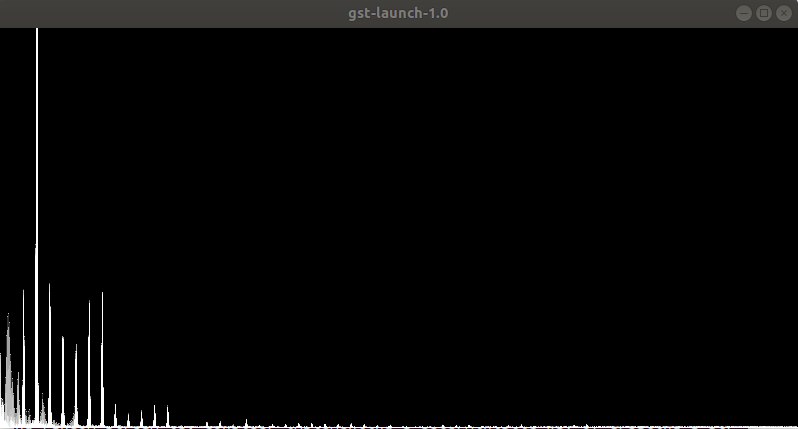
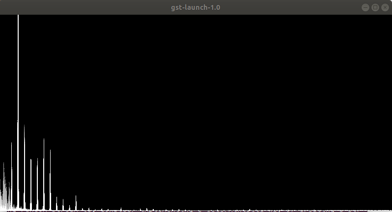
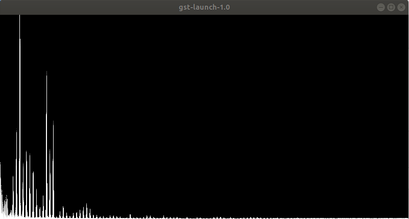

# Multiple Stream Mixing Test

## Questions

1. Is mixing incoming streams or just playing them through separate threads better?
2. How many streams can each technique handle {audiomixer vs separate threads} before breaking down?

## Testing

### Getting the Frequency Spectrum
`gst-launch-1.0 autoaudiosrc ! audio/x-raw,rate=16000,format=S16LE,channels=1 ! audioconvert ! spectrascope ! videoconvert ! video/x-raw,width=800,height=400 ! autovideosink`

### Test Setup (4 Stream Example)
#### Separate Threads
In **four** separate terminals:

*Terminal 1*

`gst-launch-1.0 audiotestsrc freq=262 ! audio/x-raw,rate=16000,format=S16LE,channels=1 ! audioconvert ! autoaudiosink`

*Terminal 2*

`gst-launch-1.0 audiotestsrc freq=327 ! audio/x-raw,rate=16000,format=S16LE,channels=1 ! audioconvert ! autoaudiosink`

*Terminal 3*

`gst-launch-1.0 audiotestsrc freq=393 ! audio/x-raw,rate=16000,format=S16LE,channels=1 ! audioconvert ! autoaudiosink`

*Terminal 4*

`gst-launch-1.0 audiotestsrc freq=524 ! audio/x-raw,rate=16000,format=S16LE,channels=1 ! audioconvert ! autoaudiosink`

#### Audiomixer Setup
In **one** terminal:

`gst-launch-1.0 audiotestsrc freq=262 ! audio/x-raw,rate=16000,format=S16LE,channels=1 ! audiomixer name=mix ! audioconvert ! autoaudiosink audiotestsrc freq=327 ! audio/x-raw,rate=16000,format=S16LE,channels=1 ! mix. audiotestsrc freq=393 ! audio/x-raw,rate=16000,format=S16LE,channels=1 ! mix. audiotestsrc freq=524 ! audio/x-raw,rate=16000,format=S16LE,channels=1 ! mix.`

### Results
#### 2 Streams (C and E --> 262 Hz and 327.5 Hz respectively)
*Multiple Threads*

*Audio Mixer*

#### 3 Streams (C, E, and G --> 262, 327.5, and 393 Hz respectively)
*Multiple Threads*

*Audio Mixer*

#### 4 Streams (C, E, G, and High C --> 262, 327.5, 393 and 524 Hz respectively)
*Multiple Threads*

*Audio Mixer*

